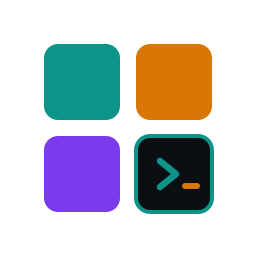

# Hi, ich bin Michael 👋

   <a href="README.md">English</a> ·
   <b>Deutsch</b>

---

.NET-Entwickler mit Schwerpunkt auf C#, SQL Server und Sitefinity CMS. In meiner Freizeit baue ich Terminal-Tools mit Python und [Textual](https://github.com/Textualize/textual) sowie Websites mit React und Astro.

Wenn ich nicht programmiere: Katzen, Pferde und Skateboarding.

## Ausgewählte Projekte

🎵 **[retro-amp](https://github.com/michaelblaess/retro-amp)** — Ein Terminal-Musikplayer im Retro-Stil mit Echtzeit-FFT-Visualisierung, Songtexten und 31 Themes

🔍 **[inspectcode-tui](https://github.com/michaelblaess/inspectcode-tui)** — Durchsuche und behebe JetBrains-InspectCode-Ergebnisse direkt im Terminal

📸 **[visual-regression-scanner](https://github.com/michaelblaess/visual-regression-scanner)** — Erkenne visuelle Regressionen durch Vergleich von Ganzseiten-Screenshots mit hinterlegten Referenzen

<picture><source media="(prefers-color-scheme: dark)" srcset="docs/icons/sitemap-tracker-dark.svg"></picture> **[sitemap-tracker](https://github.com/michaelblaess/sitemap-tracker)** — Crawle Websites und erzeuge standardkonforme sitemap.xml-Dateien

🐛 **[console-error-scanner](https://github.com/michaelblaess/console-error-scanner)** — Scanne Websites auf JavaScript-Konsolenfehler und HTTP-Fehler

<picture><source media="(prefers-color-scheme: dark)" srcset="docs/icons/textual-themes-dark.svg"></picture> **[textual-themes](https://github.com/michaelblaess/textual-themes)** — Retro-Farbthemes für Textual-TUI-Anwendungen

## Tech

C# · .NET · SQL Server · Sitefinity CMS · Python · Textual · Playwright · React · Astro
